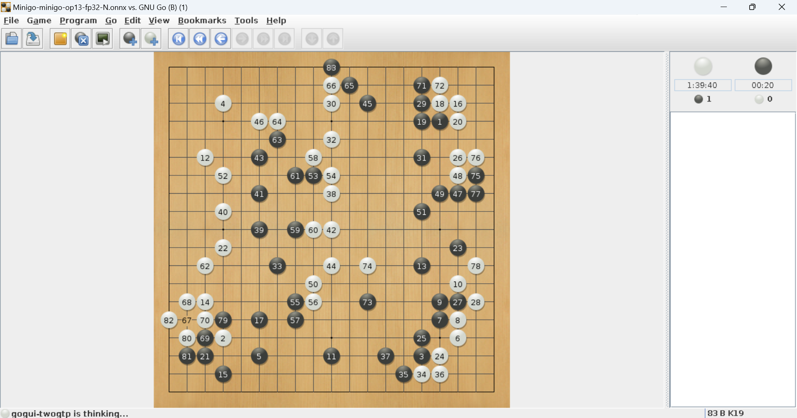

# MiniGO ONNX version

## Introduction

this project is a port of MiniGO to onnxruntime backend. this port runs on onnxruntime which has a broader compatibility to hardwares.

## Usage

### install prerequisite

```shell
pip3 install -r requirements.txt
sudo apt install default-jre gnugo
```

download and install [gogui](https://sourceforge.net/projects/gogui/).

### how to run

watch MiniGO playing against GnuGO

```shell
bash minigo_vs_gnugo.sh
```

duel with MiniGO

```shell
bash minigo_vs_human.sh
```

### screen shot

<p align="center">
  
</p>
